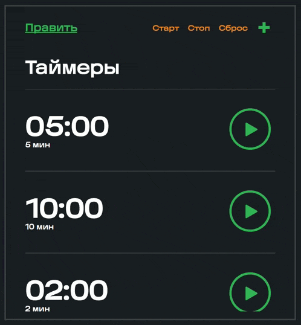

## Test Task
Develop an application based on the layout - an analogue of a timer in iOS or Android using React.
1. Ability to create an infinite number of timers;
2. Add timers;
3. Delete timers;
4. Start timers individually;
5. Start all timers;
6. Pause all timers;
7. Reset all timers.
________________________________________________________________________________
[Link to Figma](https://www.figma.com/file/l5KBtHDKDjHnvRzYdd2bYc/Untitled?type=design&node-id=0%3A1&mode=design&t=ADFEDAlw7eArIm9y-1)
________________________________________________________________________________
### Author's note:
The layout doesn't specify what the implementation of pausing, resetting, and deleting all timers should look like, so I implemented that with my solution.
________________________________________________________________________________
### Demonstration of project



________________________________________________________________________________
### Installation
```npm install```
### Usage
```npm run dev```


